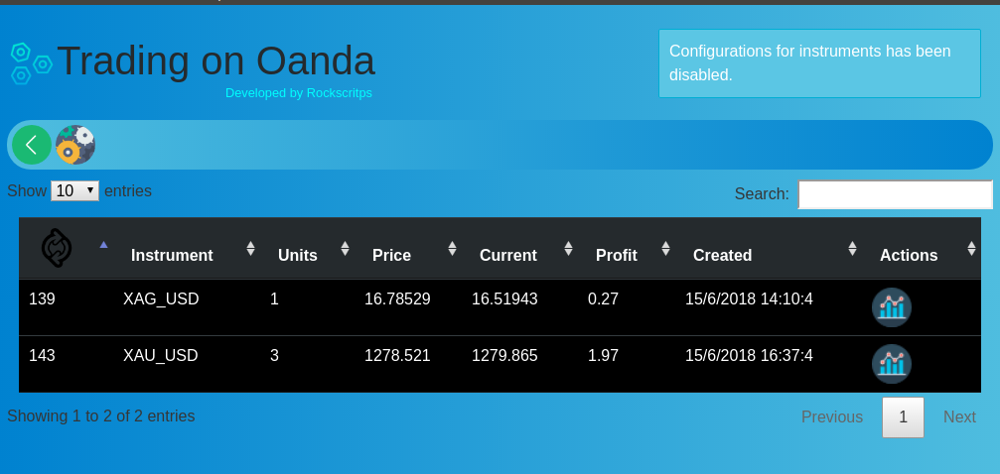
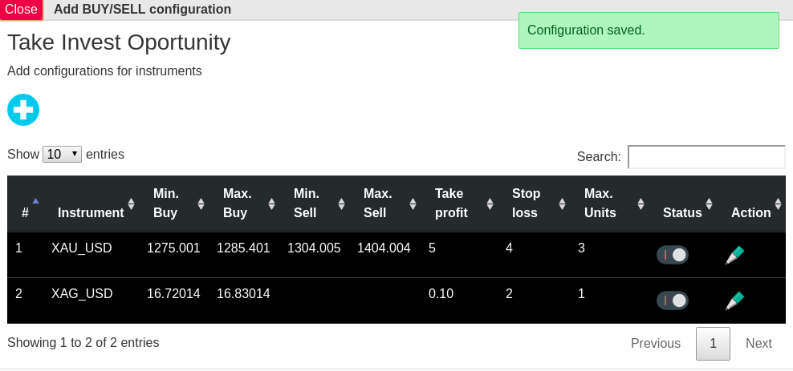
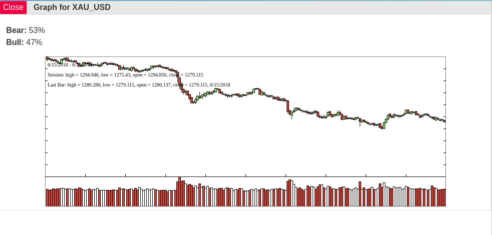

<h1>Boot for trading on OANDA</h1>

This application buy and sell in differents markets using Oanda platform, i recommend operate with gold, silver and copper. It was tested in a practice account and it is stable.

Use this application in practice mode while you are familiar with.

<h4>How does it works?</h4>

It provides a user interface for making invests based on your configuration like price ranges, bear and bull probability for buying and selling, take control in profits and losses automatically without spend hours in computer. It runs in background with cronjobs or through this application GUI

 

Contact me if you have any questions: <b>rockscripts@gmail.com</b>

<h1>INSTALLING APPLICATION</h1>
<h4>Requirements</h4>

This is a NODEJS application and you need follow things in your operating system:
<ul>
<li>GIT</li>
<li>Nodejs</li>
<li>NPM</li>
<li>Web Server With PHPMYADMIN</li>
</ul>

<h4>Run APP</h4>

Open your Terminal and paste follow commands
<ul>
<li>Add/Download project in your workspace <b>git clone https://github.com/rockscripts/Boot-Notification-Trade-Oanda.git</b></li>
<li>Install dependencies <b>npm install</b> </li>
<li>Create database and import <b>database.sql</b> located in root project in your phpmyadmin.</li>
<li>Execute application with <b>npm start</b></li>
<li>Background invests with cronjob use this command <b>* * * * * sleep 02; /usr/bin/node /home/rockscripts/Documents/nodejs/Boot-Notification-Trade-Oanda/src/cron-trades-invest.js</b></li>
<li>Background profits and losses with cronjob use this command <b>* * * * * sleep 03;  /usr/bin/node /home/rockscripts/Documents/nodejs/Boot-Notification-Trade-Oanda/src/cron-trades-profit.js</b></li>
</ul>

<b>Components Used under MIT Licence</b>
<ul  style="font-size:9px!important">
<li><a href="https://github.com/oanda/v20-javascript" target="_blank">Official Oanda v02</a></li>
<li><a href="https://github.com/flagpoonage/node-oanda" target="_blank">Node Oanda v02 (used for some calls)</a></li>
<li><a href="https://www.npmjs.com/package/mysql" target="_blank">MYSQL</a></li>
<li><a href="https://www.npmjs.com/package/cron" target="_blank">CRONJOB</a></li>
<li><a href="https://www.npmjs.com/package/noty" target="_blank">Noty</a></li>
<li><a href="https://www.npmjs.com/package/jquery" target="_blank">jQuery</a></li>
<li><a href="https://www.npmjs.com/package/jquery-ui-bundle" target="_blank">jQuery UI</a></li>
<li><a href="https://www.npmjs.com/package/datatables.net-responsive" target="_blank">Datatable (Responsive)</a></li>
<li><a href="https://www.npmjs.com/package/fontawesome" target="_blank">Fontawesome</a></li>
<li><a href="https://www.npmjs.com/package/currency-formatter" target="_blank">Currency Formatter</a></li>
<li><a href="https://www.npmjs.com/package/dom-form-serializer" target="_blank">DOM form serializer</a></li>
<li><a href="https://www.npmjs.com/package/candlesjs" target="_blank">Candlesjs</a></li>
</ul>

Icons made by <a href="https://www.flaticon.com/authors/smashicons" title="Smashicons">Smashicons</a> from <a href="https://www.flaticon.com/" title="Flaticon">www.flaticon.com</a> is licensed by <a href="http://creativecommons.org/licenses/by/3.0/" title="Creative Commons BY 3.0" target="_blank">CC 3.0 BY</a>

Icons made by <a href="https://www.flaticon.com/authors/maxim-basinski" title="Maxim Basinski">Maxim Basinski</a> from <a href="https://www.flaticon.com/" title="Flaticon">www.flaticon.com</a> is licensed by <a href="http://creativecommons.org/licenses/by/3.0/" title="Creative Commons BY 3.0" target="_blank">CC 3.0 BY</a>

Icons made by <a href="https://www.flaticon.com/authors/roundicons" title="Roundicons">Roundicons</a> from <a href="https://www.flaticon.com/" title="Flaticon">www.flaticon.com</a> is licensed by <a href="http://creativecommons.org/licenses/by/3.0/" title="Creative Commons BY 3.0" target="_blank">CC 3.0 BY</a>

Icons made by <a href="https://www.flaticon.com/authors/pixel-perfect" title="Pixel perfect">Pixel perfect</a> from <a href="https://www.flaticon.com/" title="Flaticon">www.flaticon.com</a> is licensed by <a href="http://creativecommons.org/licenses/by/3.0/" title="Creative Commons BY 3.0" target="_blank">CC 3.0 BY</a>

Icons made by <a href="https://www.flaticon.com/authors/smashicons" title="Smashicons">Smashicons</a> from <a href="https://www.flaticon.com/" title="Flaticon">www.flaticon.com</a> is licensed by <a href="http://creativecommons.org/licenses/by/3.0/" title="Creative Commons BY 3.0" target="_blank">CC 3.0 BY</a>

Icons made by <a href="https://www.flaticon.com/authors/smashicons" title="Switch">Switch</a> from <a href="https://www.flaticon.com/"     title="Flaticon">www.flaticon.com</a> is licensed by <a href="http://creativecommons.org/licenses/by/3.0/"     title="Creative Commons BY 3.0" target="_blank">CC 3.0 BY</a>

Icons made by <a href="https://www.flaticon.com/authors/stephen-hutchings" title="Stephen Hutchings">Stephen Hutchings</a> from <a href="https://www.flaticon.com/" title="Flaticon">www.flaticon.com</a> is licensed by <a href="http://creativecommons.org/licenses/by/3.0/" title="Creative Commons BY 3.0" target="_blank">CC 3.0 BY</a>

Icons made by <a href="https://www.flaticon.com/authors/vectors-market" title="Vectors Market">Vectors Market</a> from <a href="https://www.flaticon.com/" title="Flaticon">www.flaticon.com</a> is licensed by <a href="http://creativecommons.org/licenses/by/3.0/" title="Creative Commons BY 3.0" target="_blank">CC 3.0 BY</a>
